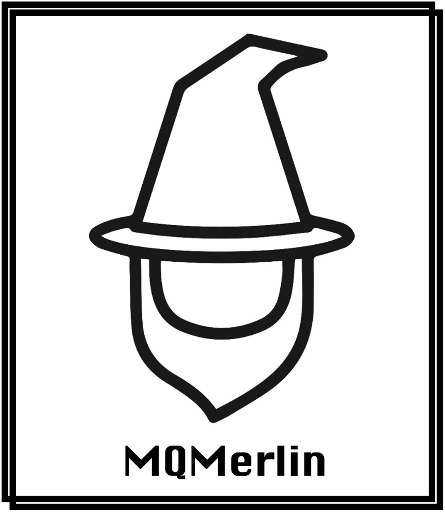

# MQMerlin

<!-- PROJECT LOGO -->
 

  

  

    MQMerlin is a user-friendly tool aimed at simplifying the monitoring and troubleshooting of IBM MQ systems.
     
     
    <a href="https://www.youtube.com/watch?v=ttXFpTWPafs">Demo Video</a>
    
  
  

<!-- TABLE OF CONTENTS -->

  
Table of Contents

  <ol>
    <li>
      <a href="#about-the-project">About</a>
    </li>
    <li>
      <a href="#getting-started">Getting Started</a>
    </li>
    <li><a href="#usage">Usage</a></li>
    <li><a href="#MQMerlin-Team">MQMerlin-Team</a></li>
    <li><a href="#acknowledgements">Acknowledgements</a></li>
     <li><a href="#license">License</a></li>
  </ol>

<!-- ABOUT THE PROJECT -->
## About The Project

MQMerlin is designed to aid IBM MQ users in early issue identification and resolution by displaying crucial system information in an easily comprehensible manner. A standout feature is its specialised AI chatbot that addresses user queries regarding IBM MQ and offers troubleshooting advice for identified issues. Based on modern language learning models, this chatbot has shown promise for future enhancements through rigorous testing.

<!-- GETTING STARTED -->
## Getting Started

### Usage Prerequisites
- A compatible computer OS (Mac, Windows, Linux).
- Installed Python 3.
- Installed Java.

### Downloading the Application
1. Go to the MQMerlin GitHub repository.
2. Download a release corresponding to your OS (Windows, macOS).

### Backend Setup
1. Navigate to the backend folder within the downloaded repository.
2. Confirm the installation of Python 3 and Java on your machine by running `python3 --version` and `java -version` in the terminal.
3. Install the necessary Python packages using pip.

### IBM MQ Setup
- The MQ instance in question needs to have events, accounting and statistics enabled. Make sure this is set up:
  - Use custom IBM MQ image located in 'CUSTOM_MQ'.
  - Follow along with MQSC script and apply to your own MQ instance.

### Running the Backend
1. Inside the backend folder, start the Flask server using the specified command.
2. The Flask server will start and listen on port 5000 by default.
3. Navigate to the ChatBot module folder within the backend folder and replace the APIKEY field with your own OpenAI API key.

### Running MQMerlin
1. With the backend running, launch the Unity app.
2. The frontend will automatically connect to the backend via port 5000.
3. Now, you can interact with the MQMerlin application through the Unity interface.

>Note: The default port 5000 can be changed if desired, both in the Flask server configuration and in the Unity app settings.

<!-- USAGE -->
## Usage

See <a href="https://www.youtube.com/watch?v=ttXFpTWPafs">demo video</a>.

<!-- CONTACT -->
## MQMerlin Team

- [Zaid Samadi](https://github.com/Zaid1120)
- [Fergus Cassidy](https://github.com/Fergus2299)
- [Hugo Giddins](https://github.com/Hgiddins)

We express our deepest gratitude towards our supervisors: John McNamara, Dr. Yuzuko Nakamura, Warren Mante, and Richard Coppen for their invaluable guidance and support throughout this project.

<!-- ACKNOWLEDGEMENTS -->
## Acknowledgements

- Supervisors: John McNamara, Dr. Yuzuko Nakamura, Warren Mante and Richard Coppen.

<!-- LICENSE -->
## License

Distributed under the Apache 2.0 License. See `LICENSE` for more information.

